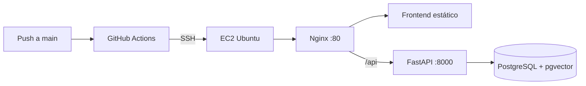

# Despliegue en AWS EC2 con GitHub Actions

Guía para desplegar **Semantic Explorer** en una instancia EC2 del AWS Learner Lab, con despliegue automático en cada push a `main`.

## Arquitectura



- El frontend se compila en build time (`VITE_API_URL` vacío → peticiones relativas `/api/...`).
- Nginx hace proxy de `/api`, `/docs` y `/redoc` al backend.
- La base de datos y el modelo de embeddings persisten en volúmenes Docker.

## Requisitos

| Recurso | Recomendación |
|---------|----------------|
| Instancia EC2 | `t3.medium` o superior (mín. 4 GB RAM; el modelo de embeddings usa CPU/RAM) |
| SO | Ubuntu 22.04/24.04 |
| Disco | ≥ 30 GB (modelo Hugging Face + PostgreSQL) |
| Puertos abiertos (Security Group) | 22 (SSH), 80 (HTTP) |

## 1. Preparar el Learner Lab

1. Inicia la sesión del lab en AWS Academy.
2. Copia las credenciales temporales si vas a usar la consola AWS.
3. Lanza una instancia EC2:
   - AMI: **Ubuntu Server 22.04 LTS**
   - Tipo: **t3.medium**
   - Key pair: crea o usa una existente (descarga el `.pem`).
   - Security Group: permite **SSH (22)** desde tu IP y **HTTP (80)** desde `0.0.0.0/0` (solo para pruebas del lab).
4. Asigna o anota la **IP pública** de la instancia.

> **Nota del lab:** las credenciales y a veces las instancias expiran al cerrar sesión. Guarda backups de la DB y anota la IP; puede cambiar al reiniciar la instancia.

## 2. Configurar la EC2 (una sola vez)

Conéctate por SSH:

```bash
chmod 400 tu-clave.pem
ssh -i tu-clave.pem ubuntu@TU_IP_PUBLICA
```

En la instancia:

```bash
git clone https://github.com/Varo-27/proyectoEOM.git ~/proyectoEOM
cd ~/proyectoEOM
./scripts/ec2-bootstrap.sh
```

Sal y vuelve a entrar (para el grupo `docker`), luego edita el entorno:

```bash
nano ~/proyectoEOM/web-semantic-explorer/.env
```

Usa `web-semantic-explorer/.env.production.example` como referencia. Cambia obligatoriamente:

- `DOMAIN` y `FRONTEND_HOST` → IP pública de la EC2 (ej. `http://203.0.113.10`)
- `BACKEND_CORS_ORIGINS` → misma URL
- `SECRET_KEY`, `POSTGRES_PASSWORD`, `FIRST_SUPERUSER_PASSWORD` → valores seguros (no `changethis`)
- `ENVIRONMENT=production`

Restaura la base de datos si tienes backup:

```bash
cd ~/proyectoEOM
./scripts/restore-db.sh ruta/al/app-db-data-*.tar.gz
```

Prueba el despliegue manual:

```bash
./scripts/deploy.sh
```

Abre `http://TU_IP_PUBLICA` en el navegador.

## 3. Secrets de GitHub

En el repositorio **Varo-27/proyectoEOM** → **Settings → Secrets and variables → Actions → New repository secret**:

| Secret | Valor |
|--------|--------|
| `EC2_HOST` | IP pública o DNS de la EC2 |
| `EC2_USER` | `ubuntu` |
| `EC2_SSH_KEY` | Contenido completo del archivo `.pem` (incluye `-----BEGIN...` y `-----END...`) |
| `EC2_APP_DIR` | (opcional) Ruta del repo en el servidor; por defecto `/home/ubuntu/proyectoEOM` |
| `EC2_SSH_PORT` | (opcional) Puerto SSH; por defecto `22` |

## 4. Flujo de despliegue

Cada **push a `main`** ejecuta `.github/workflows/deploy.yml`:

1. GitHub Actions se conecta por SSH a la EC2.
2. Hace `git fetch` + `git reset --hard origin/main`.
3. Ejecuta `./scripts/deploy.sh` → `docker compose -f compose.prod.yml up -d --build`.

Para desplegar manualmente desde tu PC:

```bash
git push origin main
```

Monitoriza en **Actions** del repositorio en GitHub.

## 5. Comandos útiles en la EC2

```bash
cd ~/proyectoEOM

# Ver estado
docker compose -f compose.prod.yml ps

# Logs
docker compose -f compose.prod.yml logs -f backend
docker compose -f compose.prod.yml logs -f frontend

# Reiniciar un servicio
docker compose -f compose.prod.yml restart backend

# Backup de la DB
./scripts/backup-db.sh
```

## 6. Solución de problemas

| Síntoma | Qué revisar |
|---------|-------------|
| Workflow falla en SSH | IP correcta, instancia encendida, Security Group puerto 22, secret `EC2_SSH_KEY` bien pegado |
| 502 / API no responde | `docker compose -f compose.prod.yml logs backend` — el modelo tarda en cargar la primera vez |
| Error de secretos en backend | `.env` con `ENVIRONMENT=production` y contraseñas distintas de `changethis` |
| Sin datos | Restaurar backup con `./scripts/restore-db.sh` |
| Lab cerrado | Reinicia instancia, actualiza `EC2_HOST` y variables `DOMAIN`/`FRONTEND_HOST` si cambió la IP |

## 7. Alternativa sin GitHub Actions

Si prefieres desplegar solo desde la EC2:

```bash
cd ~/proyectoEOM
git pull origin main
./scripts/deploy.sh
```
