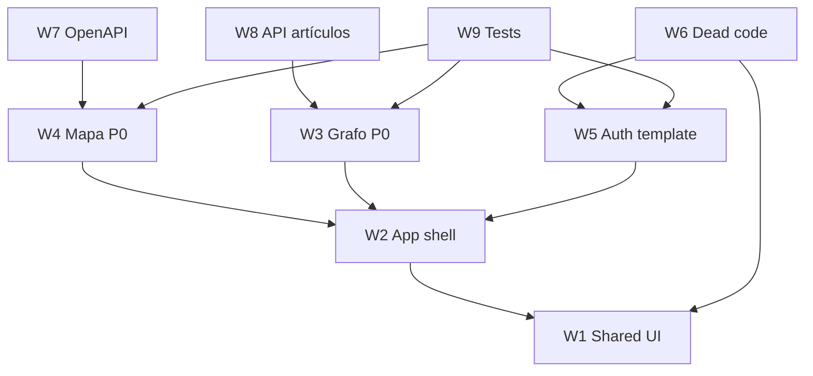

# Plan de refactorización frontend

**Proyecto:** `/home/alevi/proyecto/web-semantic-explorer/frontend`  
**Basado en:** [frontend-refactor-audit.md](./frontend-refactor-audit.md)  
**Enfoque FSD:** Minimal (`app/` + `pages/` + `shared/`) — sin `entities/`/`features/` prematuras

---

## Priorización global

| Fase | Workstreams | Objetivo | Duración orientativa |
|------|-------------|----------|----------------------|
| **F0** | W3 (cerrar), W4 | Completar refactors a medias del producto core | 1–2 semanas |
| **F1** | W1, W2 | Migrar a esqueleto FSD + routing limpio | 1 semana |
| **F2** | W5, W6 | Limpiar template FastAPI y código muerto | 3–5 días |
| **F3** | W7, W8 | API real artículos, tipado, cliente OpenAPI | 1 semana |
| **F4** | W9 | Tests E2E + gates CI | 1 semana |

---

## Workstreams (rutas exclusivas)

> Cada archivo aparece en **exactamente un** workstream. Rutas absolutas bajo `frontend/src/` salvo indicación.

### W1 — Infraestructura shared (UI kit + bootstrap helpers)

**Prioridad:** P1 · **Fase:** F1

**Objetivo:** Consolidar `shared/ui` y utilidades puras; preparar migración desde `components/ui` y `lib/utils.ts`.

| Ruta |
|------|
| `/home/alevi/proyecto/web-semantic-explorer/frontend/src/lib/utils.ts` |
| `/home/alevi/proyecto/web-semantic-explorer/frontend/src/hooks/useMobile.ts` |
| `/home/alevi/proyecto/web-semantic-explorer/frontend/src/hooks/useCustomToast.ts` |
| `/home/alevi/proyecto/web-semantic-explorer/frontend/src/components/ui/alert.tsx` |
| `/home/alevi/proyecto/web-semantic-explorer/frontend/src/components/ui/avatar.tsx` |
| `/home/alevi/proyecto/web-semantic-explorer/frontend/src/components/ui/badge.tsx` |
| `/home/alevi/proyecto/web-semantic-explorer/frontend/src/components/ui/button-group.tsx` |
| `/home/alevi/proyecto/web-semantic-explorer/frontend/src/components/ui/button.tsx` |
| `/home/alevi/proyecto/web-semantic-explorer/frontend/src/components/ui/card.tsx` |
| `/home/alevi/proyecto/web-semantic-explorer/frontend/src/components/ui/checkbox.tsx` |
| `/home/alevi/proyecto/web-semantic-explorer/frontend/src/components/ui/dialog.tsx` |
| `/home/alevi/proyecto/web-semantic-explorer/frontend/src/components/ui/dropdown-menu.tsx` |
| `/home/alevi/proyecto/web-semantic-explorer/frontend/src/components/ui/form.tsx` |
| `/home/alevi/proyecto/web-semantic-explorer/frontend/src/components/ui/input.tsx` |
| `/home/alevi/proyecto/web-semantic-explorer/frontend/src/components/ui/label.tsx` |
| `/home/alevi/proyecto/web-semantic-explorer/frontend/src/components/ui/loading-button.tsx` |
| `/home/alevi/proyecto/web-semantic-explorer/frontend/src/components/ui/pagination.tsx` |
| `/home/alevi/proyecto/web-semantic-explorer/frontend/src/components/ui/password-input.tsx` |
| `/home/alevi/proyecto/web-semantic-explorer/frontend/src/components/ui/select.tsx` |
| `/home/alevi/proyecto/web-semantic-explorer/frontend/src/components/ui/separator.tsx` |
| `/home/alevi/proyecto/web-semantic-explorer/frontend/src/components/ui/sheet.tsx` |
| `/home/alevi/proyecto/web-semantic-explorer/frontend/src/components/ui/sidebar.tsx` |
| `/home/alevi/proyecto/web-semantic-explorer/frontend/src/components/ui/skeleton.tsx` |
| `/home/alevi/proyecto/web-semantic-explorer/frontend/src/components/ui/sonner.tsx` |
| `/home/alevi/proyecto/web-semantic-explorer/frontend/src/components/ui/table.tsx` |
| `/home/alevi/proyecto/web-semantic-explorer/frontend/src/components/ui/tabs.tsx` |
| `/home/alevi/proyecto/web-semantic-explorer/frontend/src/components/ui/tooltip.tsx` |

**Tareas:**
1. Mover a `src/shared/ui/` con `index.ts` por segmento.
2. Inventariar componentes shadcn sin uso (`button-group`, `pagination`, `sheet`, `alert`) → eliminar o documentar.
3. Exportar `cn` desde `shared/lib/classnames.ts`.

**Done cuando:** Imports `@/shared/ui/*` funcionan; build sin warnings de unused en ui.

---

### W2 — App shell + routing (capa `app/` + layout)

**Prioridad:** P1 · **Fase:** F1

**Objetivo:** Separar bootstrap, layout autenticado y piezas transversales de error/navegación.

| Ruta |
|------|
| `/home/alevi/proyecto/web-semantic-explorer/frontend/src/main.tsx` |
| `/home/alevi/proyecto/web-semantic-explorer/frontend/src/index.css` |
| `/home/alevi/proyecto/web-semantic-explorer/frontend/src/vite-env.d.ts` |
| `/home/alevi/proyecto/web-semantic-explorer/frontend/src/components/theme-provider.tsx` |
| `/home/alevi/proyecto/web-semantic-explorer/frontend/src/routeTree.gen.ts` |
| `/home/alevi/proyecto/web-semantic-explorer/frontend/src/routes/__root.tsx` |
| `/home/alevi/proyecto/web-semantic-explorer/frontend/src/routes/_layout.tsx` |
| `/home/alevi/proyecto/web-semantic-explorer/frontend/src/components/Layout/DashboardLayout.tsx` |
| `/home/alevi/proyecto/web-semantic-explorer/frontend/src/components/Layout/TopNavBar.tsx` |
| `/home/alevi/proyecto/web-semantic-explorer/frontend/src/components/Layout/PageShell.tsx` |
| `/home/alevi/proyecto/web-semantic-explorer/frontend/src/components/Layout/navConfig.ts` |
| `/home/alevi/proyecto/web-semantic-explorer/frontend/src/components/Common/Logo.tsx` |
| `/home/alevi/proyecto/web-semantic-explorer/frontend/src/components/Common/Footer.tsx` |
| `/home/alevi/proyecto/web-semantic-explorer/frontend/src/components/Common/NotFound.tsx` |
| `/home/alevi/proyecto/web-semantic-explorer/frontend/src/components/Common/ErrorComponent.tsx` |

**Tareas:**
1. Crear `src/app/providers/` (Query, Theme, Router) extrayendo lógica de `main.tsx`.
2. Mover layout a `src/app/layouts/DashboardLayout.tsx` o `widgets/` si se reutiliza.
3. Unificar selector de tema: extraer `ThemeToggle` compartido (eliminar duplicación con W5 `Appearance`).
4. Actualizar alias TS/vite: `@/app`, `@/pages`, `@/shared`.

**Done cuando:** `main.tsx` < 30 LOC; layout y providers testeables; rutas apuntan a pages.

---

### W3 — Page Grafo (`/`)

**Prioridad:** P0 · **Fase:** F0

**Objetivo:** Consolidar slice del explorador semántico; reducir acoplamiento del store global.

| Ruta |
|------|
| `/home/alevi/proyecto/web-semantic-explorer/frontend/src/routes/_layout/index.tsx` |
| `/home/alevi/proyecto/web-semantic-explorer/frontend/src/components/Graph/GraphExplorer.tsx` |
| `/home/alevi/proyecto/web-semantic-explorer/frontend/src/components/Graph/ArticleNodeModal.tsx` |
| `/home/alevi/proyecto/web-semantic-explorer/frontend/src/components/Graph/SearchBar.tsx` |
| `/home/alevi/proyecto/web-semantic-explorer/frontend/src/components/Graph/graphConstants.ts` |
| `/home/alevi/proyecto/web-semantic-explorer/frontend/src/components/Graph/graphLayout.ts` |
| `/home/alevi/proyecto/web-semantic-explorer/frontend/src/components/Graph/graphMappers.ts` |
| `/home/alevi/proyecto/web-semantic-explorer/frontend/src/components/Graph/useGraphExplorerActions.ts` |
| `/home/alevi/proyecto/web-semantic-explorer/frontend/src/components/Graph/nodes/ArticleNode.tsx` |
| `/home/alevi/proyecto/web-semantic-explorer/frontend/src/components/Graph/nodes/SearchNode.tsx` |
| `/home/alevi/proyecto/web-semantic-explorer/frontend/src/store/useGraphStore.ts` |
| `/home/alevi/proyecto/web-semantic-explorer/frontend/src/mocks/articleDetail.mock.ts` |

**Tareas:**
1. Mover a `pages/graph/` con segmentos `ui/`, `model/`, `api/`, `lib/`.
2. Eliminar `[key: string]: any` de `AppNodeData`; tipar desde OpenAPI (`GraphNode`, `ArticleSearchResult`).
3. Evaluar store page-local: `GraphProvider` + context o Zustand scoped al montaje de la page.
4. Reemplazar patrón `setExpandSimilar` por callback vía React Flow `nodeTypes` factory o context.
5. Podar acciones muertas: `clearGraph`, `addNodes`, `addEdges`.
6. Preparar swap mock→API en modal (coordinar con W8).

**Done cuando:** `GraphExplorer.tsx` ≤ 150 LOC; store no persiste al desmontar page; build strict OK.

---

### W4 — Page Mapa (`/map`)

**Prioridad:** P0 · **Fase:** F0

**Objetivo:** **Cablear refactor parcial** — integrar hooks y subcomponentes ya escritos.

| Ruta |
|------|
| `/home/alevi/proyecto/web-semantic-explorer/frontend/src/routes/_layout/map.tsx` |
| `/home/alevi/proyecto/web-semantic-explorer/frontend/src/components/Map/GeoHeatmap.tsx` |
| `/home/alevi/proyecto/web-semantic-explorer/frontend/src/components/Map/WorldChoropleth.tsx` |
| `/home/alevi/proyecto/web-semantic-explorer/frontend/src/components/Map/GeoHeatmapSidebar.tsx` |
| `/home/alevi/proyecto/web-semantic-explorer/frontend/src/components/Map/GeoHeatmapMapTooltip.tsx` |
| `/home/alevi/proyecto/web-semantic-explorer/frontend/src/components/Map/types.ts` |
| `/home/alevi/proyecto/web-semantic-explorer/frontend/src/components/Map/hooks/useHeatmapData.ts` |
| `/home/alevi/proyecto/web-semantic-explorer/frontend/src/components/Map/hooks/useMapHoverState.ts` |
| `/home/alevi/proyecto/web-semantic-explorer/frontend/src/components/Map/hooks/useChoroplethZoom.ts` |
| `/home/alevi/proyecto/web-semantic-explorer/frontend/src/lib/choroplethScene.ts` |
| `/home/alevi/proyecto/web-semantic-explorer/frontend/src/lib/heatmapColors.ts` |
| `/home/alevi/proyecto/web-semantic-explorer/frontend/src/lib/mapProjections.ts` |
| `/home/alevi/proyecto/web-semantic-explorer/frontend/src/lib/countrySearchLabels.ts` |
| `/home/alevi/proyecto/web-semantic-explorer/frontend/src/lib/placeGeoResolve.ts` |
| `/home/alevi/proyecto/web-semantic-explorer/frontend/src/api/stats.ts` |
| `/home/alevi/proyecto/web-semantic-explorer/frontend/src/api/types/heatmap.ts` |
| `/home/alevi/proyecto/web-semantic-explorer/frontend/src/mocks/heatmap.mock.ts` |
| `/home/alevi/proyecto/web-semantic-explorer/frontend/src/types/d3-geo-projection.d.ts` |

**Tareas:**
1. Reescribir `GeoHeatmap.tsx` como orquestador (~120 LOC) usando `useHeatmapData`, `useMapHoverState`, `GeoHeatmapSidebar`, `GeoHeatmapMapTooltip`.
2. Eliminar `fetchHeatmap` duplicado del componente.
3. Mover libs de dominio mapa a `pages/map/lib/` (FSD) o `shared/lib/geo/` si otro consumidor aparece.
4. Public API: `pages/map/index.ts` exporta solo la page.
5. Tests unitarios de `buildCountryCounts`, `resolveCountryClickSearch` (opcional en W9).

**Done cuando:** Ningún hook/subcomponente mapa queda sin importador; `GeoHeatmap.tsx` ≤ 150 LOC.

---

### W5 — Auth, admin y settings (template FastAPI)

**Prioridad:** P2 · **Fase:** F2

**Objetivo:** Aislar template heredado; i18n ES; reducir deuda visual.

| Ruta |
|------|
| `/home/alevi/proyecto/web-semantic-explorer/frontend/src/routes/login.tsx` |
| `/home/alevi/proyecto/web-semantic-explorer/frontend/src/routes/signup.tsx` |
| `/home/alevi/proyecto/web-semantic-explorer/frontend/src/routes/recover-password.tsx` |
| `/home/alevi/proyecto/web-semantic-explorer/frontend/src/routes/reset-password.tsx` |
| `/home/alevi/proyecto/web-semantic-explorer/frontend/src/routes/_layout/admin.tsx` |
| `/home/alevi/proyecto/web-semantic-explorer/frontend/src/routes/_layout/settings.tsx` |
| `/home/alevi/proyecto/web-semantic-explorer/frontend/src/hooks/useAuth.ts` |
| `/home/alevi/proyecto/web-semantic-explorer/frontend/src/utils.ts` |
| `/home/alevi/proyecto/web-semantic-explorer/frontend/src/components/Common/AuthLayout.tsx` |
| `/home/alevi/proyecto/web-semantic-explorer/frontend/src/components/Common/Appearance.tsx` |
| `/home/alevi/proyecto/web-semantic-explorer/frontend/src/components/Common/DataTable.tsx` |
| `/home/alevi/proyecto/web-semantic-explorer/frontend/src/components/Admin/AddUser.tsx` |
| `/home/alevi/proyecto/web-semantic-explorer/frontend/src/components/Admin/columns.tsx` |
| `/home/alevi/proyecto/web-semantic-explorer/frontend/src/components/Admin/DeleteUser.tsx` |
| `/home/alevi/proyecto/web-semantic-explorer/frontend/src/components/Admin/EditUser.tsx` |
| `/home/alevi/proyecto/web-semantic-explorer/frontend/src/components/Admin/UserActionsMenu.tsx` |
| `/home/alevi/proyecto/web-semantic-explorer/frontend/src/components/UserSettings/ChangePassword.tsx` |
| `/home/alevi/proyecto/web-semantic-explorer/frontend/src/components/UserSettings/DeleteAccount.tsx` |
| `/home/alevi/proyecto/web-semantic-explorer/frontend/src/components/UserSettings/DeleteConfirmation.tsx` |
| `/home/alevi/proyecto/web-semantic-explorer/frontend/src/components/UserSettings/UserInformation.tsx` |
| `/home/alevi/proyecto/web-semantic-explorer/frontend/src/components/Pending/PendingUsers.tsx` |

**Tareas:**
1. Migrar a `pages/login/`, `pages/admin/`, etc.
2. Traducir strings EN→ES; títulos `<head>` a branding EOM.
3. Mover auth token a `shared/auth/session.ts`; tipar `extractErrorMessage` sin `any`.
4. Fusionar `Appearance` con `ThemeToggle` de W2; eliminar variantes sidebar.
5. Extraer `UserPublic` typing en `Sidebar/User` antes de borrar (W6).

**Done cuando:** 0 strings "FastAPI Cloud" en UI; `useAuth` desacoplado de redirects duplicados.

---

### W6 — Eliminación legacy (dead code)

**Prioridad:** P2 · **Fase:** F2

**Objetivo:** Retirar código huérfano post-migración TopNavBar.

| Ruta |
|------|
| `/home/alevi/proyecto/web-semantic-explorer/frontend/src/components/Sidebar/AppSidebar.tsx` |
| `/home/alevi/proyecto/web-semantic-explorer/frontend/src/components/Sidebar/Main.tsx` |
| `/home/alevi/proyecto/web-semantic-explorer/frontend/src/components/Sidebar/User.tsx` |
| `/home/alevi/proyecto/web-semantic-explorer/frontend/src/components/Pending/PendingItems.tsx` |
| `/home/alevi/proyecto/web-semantic-explorer/frontend/src/hooks/useCopyToClipboard.ts` |

**Tareas:**
1. Verificar 0 referencias con grep/Steiger antes de borrar.
2. Tras eliminar `Sidebar/*`, evaluar si `components/ui/sidebar.tsx` (W1) sigue necesario → si no, marcar para eliminación en W1.
3. Commit atómico "chore: remove legacy sidebar and unused hooks".

**Done cuando:** Archivos eliminados; `pnpm build` verde; LOC −~900 (sidebar.tsx).

---

### W7 — Cliente OpenAPI (frontera generada)

**Prioridad:** P3 · **Fase:** F3

**Objetivo:** Documentar y acotar capa generada; ampliar OpenAPI para stats si es posible.

| Ruta |
|------|
| `/home/alevi/proyecto/web-semantic-explorer/frontend/src/client/setup.ts` |
| `/home/alevi/proyecto/web-semantic-explorer/frontend/src/client/index.ts` |
| `/home/alevi/proyecto/web-semantic-explorer/frontend/src/client/schemas.gen.ts` |
| `/home/alevi/proyecto/web-semantic-explorer/frontend/src/client/sdk.gen.ts` |
| `/home/alevi/proyecto/web-semantic-explorer/frontend/src/client/types.gen.ts` |
| `/home/alevi/proyecto/web-semantic-explorer/frontend/src/client/core/ApiError.ts` |
| `/home/alevi/proyecto/web-semantic-explorer/frontend/src/client/core/ApiRequestOptions.ts` |
| `/home/alevi/proyecto/web-semantic-explorer/frontend/src/client/core/ApiResult.ts` |
| `/home/alevi/proyecto/web-semantic-explorer/frontend/src/client/core/CancelablePromise.ts` |
| `/home/alevi/proyecto/web-semantic-explorer/frontend/src/client/core/OpenAPI.ts` |
| `/home/alevi/proyecto/web-semantic-explorer/frontend/src/client/core/request.ts` |

**Tareas:**
1. Mover a `shared/api/generated/` (solo re-exports; no editar `.gen.ts`).
2. Añadir endpoint heatmap al OpenAPI backend → eliminar `api/stats.ts` manual (coordinar con W4).
3. Script `pnpm generate-client` documentado en README.

**Done cuando:** Un solo punto de import HTTP (`@/shared/api`); stats en SDK generado o excepción documentada.

---

### W8 — API real artículos + tipado modal

**Prioridad:** P3 · **Fase:** F3

**Objetivo:** Sustituir mocks del modal por API; endurecer tipos.

> Nota: Depende de endpoints backend. Mocks permanecen como fallback dev hasta entonces.

| Ruta |
|------|
| *(Sin archivos exclusivos — tarea transversal sobre W3)* |

**Tareas (aplicar en archivos W3):**
1. Crear `pages/graph/api/fetch-article-detail.ts` contra OpenAPI.
2. Sustituir `article-detail-mock` queryKey por `['article', id]`.
3. Feature flag `VITE_USE_MOCKS` para dev offline.

**Done cuando:** Modal funciona con API en staging; mock solo con flag.

---

### W9 — Testing y quality gates

**Prioridad:** P2 · **Fase:** F4

**Objetivo:** E2E mínimos + lint FSD; CI verde.

| Ruta |
|------|
| `/home/alevi/proyecto/web-semantic-explorer/frontend/playwright.config.ts` |
| `/home/alevi/proyecto/web-semantic-explorer/frontend/tests/` *(crear)* |

**Tareas:**
1. Crear `tests/auth.setup.ts`, `tests/graph.spec.ts`, `tests/map.spec.ts`.
2. Instalar `@feature-sliced/steiger`; reglas `insignificant-slice`, import layers.
3. Añadir `pnpm test:e2e` en CI.
4. Tests unitarios Vitest para `graphMappers`, `buildCountryCounts` (opcional).

**Done cuando:** ≥3 specs Playwright verdes; Steiger sin errores en `src/`.

---

## Matriz archivo → workstream

| Workstream | # archivos | Patrón de ruta |
|------------|-------------|----------------|
| **W1** | 27 | `lib/utils.ts`, `hooks/useMobile.ts`, `hooks/useCustomToast.ts`, `components/ui/**` |
| **W2** | 15 | `main.tsx`, `index.css`, `vite-env.d.ts`, `theme-provider.tsx`, `routeTree.gen.ts`, `routes/__root.tsx`, `routes/_layout.tsx`, `components/Layout/**`, `components/Common/{Logo,Footer,NotFound,ErrorComponent}.tsx` |
| **W3** | 12 | `routes/_layout/index.tsx`, `components/Graph/**`, `store/useGraphStore.ts`, `mocks/articleDetail.mock.ts` |
| **W4** | 18 | `routes/_layout/map.tsx`, `components/Map/**`, `lib/{choroplethScene,heatmapColors,mapProjections,countrySearchLabels,placeGeoResolve}.ts`, `api/**`, `mocks/heatmap.mock.ts`, `types/d3-geo-projection.d.ts` |
| **W5** | 21 | `routes/{login,signup,recover-password,reset-password}.tsx`, `routes/_layout/{admin,settings}.tsx`, `hooks/useAuth.ts`, `utils.ts`, `components/Common/{AuthLayout,Appearance,DataTable}.tsx`, `components/Admin/**`, `components/UserSettings/**`, `components/Pending/PendingUsers.tsx` |
| **W6** | 5 | `components/Sidebar/**`, `components/Pending/PendingItems.tsx`, `hooks/useCopyToClipboard.ts` |
| **W7** | 11 | `client/**` |
| **W8** | 0 | Tarea transversal (archivos en W3) |
| **W9** | 1+ | `playwright.config.ts`, `tests/**` (nuevo) |

**Total archivos asignados en src/:** 102 (+ tests por crear)

---

## Dependencias entre workstreams

---

## Criterios de done globales

- [ ] Estructura `src/{app,pages,shared}/` con Steiger verde
- [ ] 0 archivos huérfanos detectados por `tsc --noUnusedLocals`
- [ ] `GeoHeatmap.tsx` y `GraphExplorer.tsx` ≤ 150 LOC cada uno
- [ ] Store grafo scoped a page o reset en unmount
- [ ] ≥3 tests E2E Playwright
- [ ] i18n consistente (ES) en producto y auth
- [ ] Documentación de excepciones FSD (p. ej. `@x` no necesario en v1)

---

## Quick wins (≤ 1 día, antes de F0)

1. ~~**W4 parcial:** Importar `useHeatmapData` + `useMapHoverState` + `GeoHeatmapSidebar` + `GeoHeatmapMapTooltip` en `GeoHeatmap.tsx`.~~ ✅
2. ~~**W3:** Eliminar `addNodes`, `addEdges`, `clearGraph` del store.~~ ✅ (`addNodes`/`addEdges` eliminados; `clearGraph` cableado en unmount)
3. ~~**W6:** Borrar `Sidebar/*`, `PendingItems`, `useCopyToClipboard`.~~ ✅ (+ `sidebar.tsx`, `useMobile`)
4. **W5:** Cambiar títulos "FastAPI Cloud" → "Semantic Explorer".
5. **W9 parcial:** Vitest para `graphMappers` y `heatmapColors` — ✅ 6 tests; pendiente Playwright specs.

---

## Deuda para 8–9/10

| Prioridad | Item | Impacto estimado |
|-----------|------|------------------|
| P1 | Migrar a FSD minimal + Steiger | Arquitectura +1.5 |
| P1 | Playwright E2E (auth, grafo, mapa) | Tests +2 |
| P2 | API real modal artículo | Tipado + acoplamiento +0.5 |
| P2 | i18n ES template auth | Consistencia visual +0.5 |
| P3 | `ThemeToggle` compartido (eliminar dup Appearance/NavAppearance) | DRY +0.5 |
| P3 | Store grafo scoped (Provider) vs global Zustand | Estado +0.5 |
