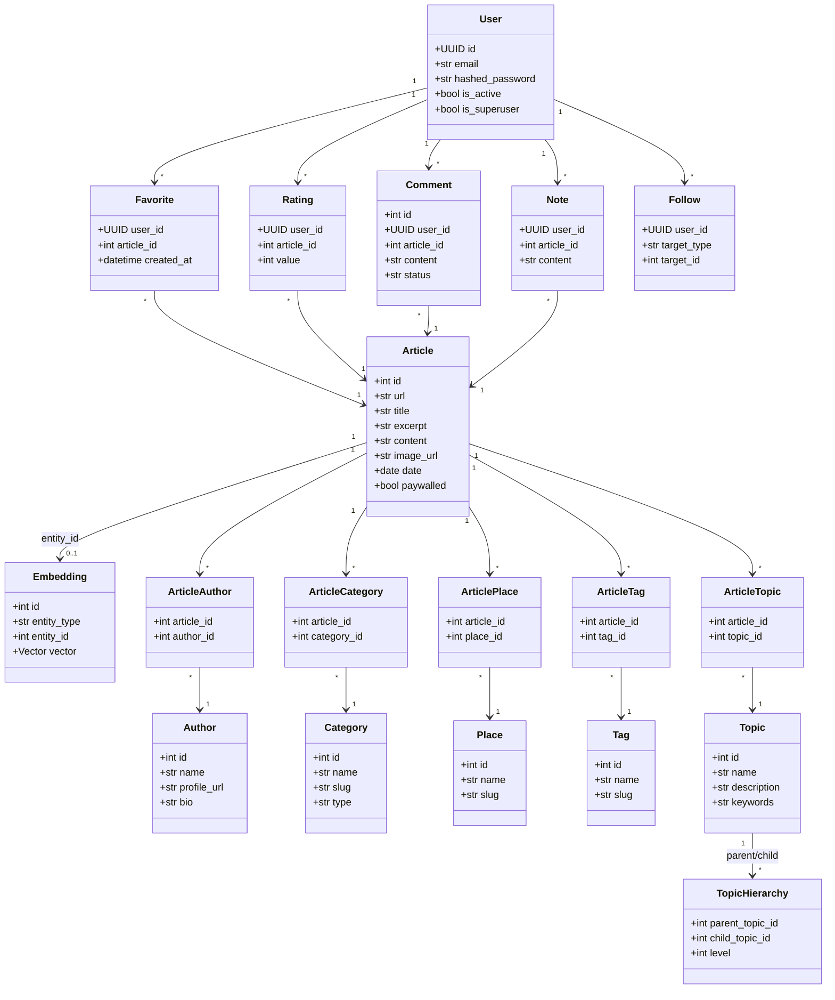
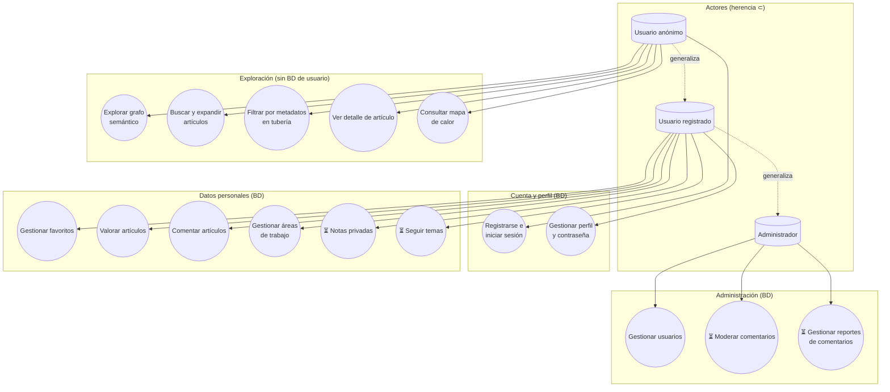
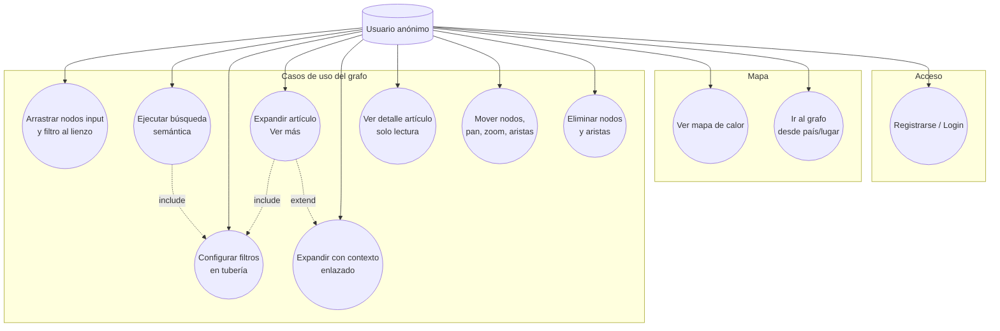
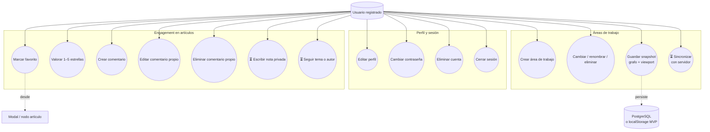
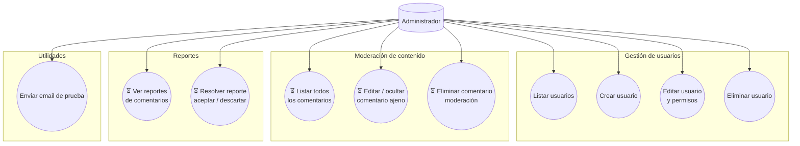
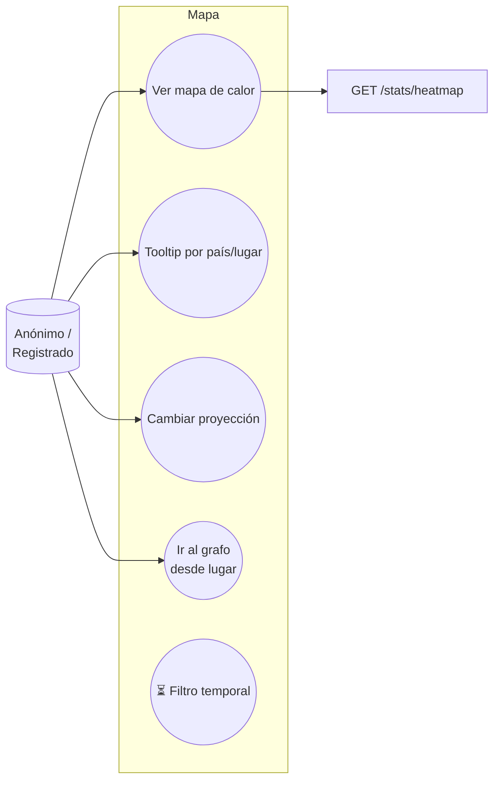
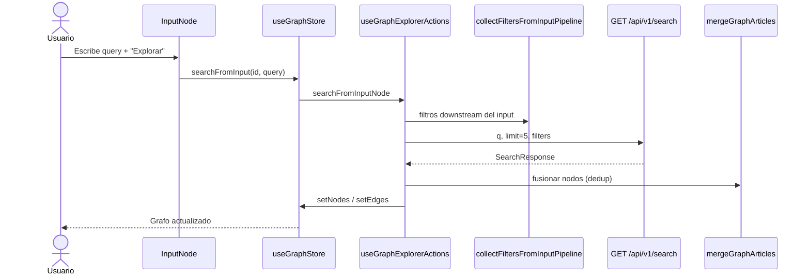
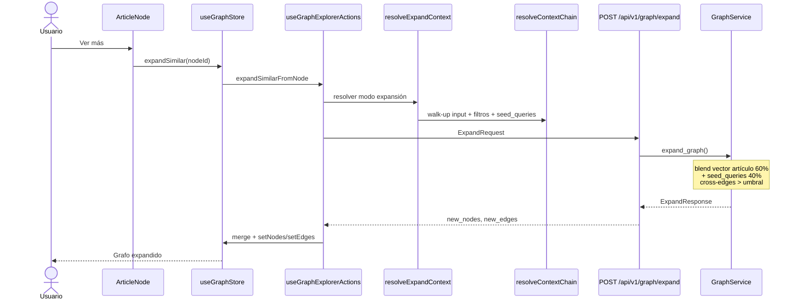

# Informe de Análisis: Web Semantic Explorer

Documento de referencia para elaborar **diagramas de clases** y **diagramas de casos de uso** del proyecto. Sintetiza lo ya implementado en el código y lo planificado en [plan_de_implementacion.md](./plan_de_implementacion.md).

**Fecha de referencia:** mayo 2026  
**Alcance:** backend FastAPI + frontend React (explorador semántico de artículos geopolíticos de El Orden Mundial)

---

## 1. Resumen ejecutivo

Web Semantic Explorer es una aplicación de investigación semántica que permite:

1. Buscar artículos por similitud vectorial (pgvector + SentenceTransformers).
2. Explorar relaciones entre artículos como un grafo interactivo (React Flow).
3. Filtrar resultados por metadatos (autor, categoría, lugar, año).
4. Interactuar socialmente con artículos (favoritos, valoraciones, comentarios).
5. Persistir sesiones de investigación en espacios de trabajo (workspaces).

La arquitectura separa **dominio de contenido** (artículos y taxonomía del scrapper), **motor semántico** (embeddings + grafo), **engagement de usuario** y **capa de presentación** (grafo como fuente de verdad con tuberías `input → filter → article`, paleta drag-and-drop y workspaces locales).

Para el TFG, el diagrama de clases de entrega recomendado es el **consolidado** (§ 4.0), no el desglose por capas § 4.1–4.3.

---

## 2. Estado del proyecto y capacidades del frontend

El detalle por fases de implementación vive en [plan_de_implementacion.md](./plan_de_implementacion.md). Este informe se centra en **diagramas UML** y en traducir lo ya construido a casos de uso.

### 2.1. Resumen de alcance

| Ámbito | Estado |
|--------|--------|
| API semántica (`/search`, `/graph/expand`, embeddings) | ✅ |
| Explorador de grafo (input, filtros, artículos, tuberías, DnD paleta) | ✅ |
| Workspaces en `localStorage` + viewport | ✅ MVP |
| Engagement (favoritos, valoración, comentarios en modal/nodo) | ✅ |
| Mapa de calor (`/map`) | ✅ |
| Sync workspaces en servidor, notas, follow, visitado, toolbar favoritos | ⏳ |
| d3-force / layout físico automático | ⏳ |
| Auto-búsqueda al llegar desde mapa (`?place=&q=`) | ⏳ |

### 2.2. Catálogo de capacidades del frontend (base para casos de uso)

Referencia completa: sección **Capacidades del frontend** del plan. Resumen por área:

| Área | Qué puede hacer el usuario hoy |
|------|--------------------------------|
| **Shell** | Navegar Grafo / Mapa / Admin; tema claro/oscuro/sistema; ajustes y sesión |
| **Workspaces** | Crear, elegir, renombrar y eliminar áreas; indicador guardado/sin guardar; autoguardado ~800 ms; restaurar nodos, aristas y cámara |
| **Paleta** | Arrastrar nodo **input** o **filtro** (autor, categoría, lugar, año desde/hasta) al lienzo; paleta bloqueada durante carga |
| **Lienzo** | Pan, zoom, rejilla, controles, minimapa; mover nodos; seleccionar nodos y aristas |
| **Aristas** | Crear conectando handles; borrar arista(s) seleccionada(s) con **Supr** o **Retroceso** |
| **Nodo input** | Escribir consulta, **Explorar**; eliminar con confirmación; múltiples inputs = islas |
| **Nodo filtro** | Editar valor (combobox en autor); encadenar en tubería; eliminar con confirmación |
| **Nodo artículo** | Ver más / ver más con contexto; abrir modal; favorito (logueado); eliminar (re-cablea aristas) |
| **Búsqueda** | Sustituye solo artículos downstream del input; merge por `article_id`; filtros y contexto upstream |
| **Expansión** | Hasta N artículos nuevos + aristas; toasts si vacío o error |
| **Modal** | Detalle API, valoración, favorito, CRUD comentarios propios |
| **Mapa** | Coropleta, proyección, zoom/pan, clic país/lugar → navega a `/` con query (grafo aún no auto-busca) |

### 2.3. Pendiente (no confundir con casos de uso actuales)

| Tema | Estado |
|------|--------|
| Validación estricta de tipos de arista | ⏳ |
| Filtro derivado desde artículo / atajo rama | ⏳ |
| Artículos visitados en lienzo | ⏳ |
| Toolbar favoritos → grafo | ⏳ |
| Workspaces en servidor | ⏳ |
| Notas privadas y Follow | ⏳ |
| Historial / deshacer pasos | ⏳ |

---

## 3. Actores del sistema

Un diagrama de casos de uso responde a la pregunta **«¿quién puede hacer qué?»**. En este proyecto hay **tres actores humanos**; no se modela al scrapper ni a sistemas externos como actores de casos de uso (van en despliegue o secuencia).

| Actor | Descripción | Autenticación |
|-------|-------------|---------------|
| **Usuario anónimo** | Explora el grafo y el mapa sin cuenta. Toda interacción **efímera** en el lienzo; nada que persista en BD ligado a identidad. | No requerida |
| **Usuario registrado** | Hereda lo del anónimo y además persiste datos propios: favoritos, valoraciones, comentarios, notas, seguimientos y áreas de trabajo guardadas. Gestiona su perfil y sesión. | JWT Bearer |
| **Administrador** | Hereda lo del registrado y además modera y administra la plataforma: usuarios, comentarios y reportes. | JWT Bearer + `is_superuser` |

### 3.1. Reglas de herencia entre actores

```text
Usuario anónimo  ⊂  Usuario registrado  ⊂  Administrador
```

- Lo que puede el anónimo, también puede el registrado y el admin.
- Lo exclusivo del registrado **no** está disponible para el anónimo (requiere login).
- Lo exclusivo del admin **no** está disponible para usuarios normales.

### 3.2. Matriz de permisos (qué puede hacer cada actor)

| Capacidad | Anónimo | Registrado | Admin |
|-----------|:-------:|:----------:|:-----:|
| **Grafo:** buscar, expandir, filtros, paleta, aristas, mover nodos | ✅ | ✅ | ✅ |
| **Grafo:** ver modal de artículo (lectura) | ✅ | ✅ | ✅ |
| **Mapa:** ver coropleta, navegar al grafo | ✅ | ✅ | ✅ |
| **Auth:** registrarse, iniciar/cerrar sesión | ✅ | ✅ | ✅ |
| **Perfil:** editar datos, cambiar contraseña, borrar cuenta | — | ✅ | ✅ |
| **Engagement:** favoritos, valorar, comentar (propios) | — | ✅ | ✅ |
| **Engagement:** notas privadas, seguir temas | — | ⏳ | ⏳ |
| **Workspaces:** varias áreas de trabajo **guardadas** (servidor o cuenta) | — | ✅ / ⏳ | ✅ / ⏳ |
| **Admin:** listar/crear/editar/eliminar usuarios | — | — | ✅ |
| **Admin:** moderar comentarios (todos los usuarios) | — | — | ⏳ |
| **Admin:** gestionar reportes de comentarios | — | — | ⏳ |

> **Nota de implementación actual:** el MVP guarda workspaces en `localStorage` también sin login. En el **modelo de casos de uso objetivo** (TFG), persistir áreas de trabajo es capacidad del **usuario registrado**; el anónimo solo trabaja en una sesión efímera del lienzo.

---

## 4. Diagrama de clases

Los diagramas siguientes están en notación Mermaid. Pueden exportarse a PNG/SVG desde editores compatibles (GitHub, Mermaid Live, VS Code).

> **Para el TFG:** las subsecciones 4.1–4.4 son material de trabajo (capas separadas). Lo que suele entregarse como «el diagrama de clases» es **una sola figura consolidada** — ver [§ 4.0](#40-diagrama-de-clases-consolidado-recomendado-para-el-tfg) y [§ 8](#8-recomendaciones-para-diagramas-finales-uml-y-tfg).

### 4.0. Diagrama de clases consolidado (recomendado para el TFG)

Vista **lógica del sistema**: dominio persistente, servicios de aplicación y piezas principales del frontend. Sin listar todos los métodos ni cada componente UI — legible en una página de memoria.

```mermaid
classDiagram
    direction TB

    package "Dominio (persistencia)" {
        class Article
        class User
        class Embedding
        class Author
        class Category
        class Place
        class Favorite
        class Rating
        class Comment
        Article --> Embedding
        Article --> Author
        Article --> Category
        Article --> Place
        User --> Favorite
        User --> Rating
        User --> Comment
        Favorite --> Article
        Rating --> Article
        Comment --> Article
    }

    package "Aplicación (API)" {
        class ArticleMetadataFilters
        class SearchResponse
        class ExpandRequest
        class ExpandResponse
        class EmbeddingService
        class GraphService
        class EngagementService
        class SearchRoute
        class GraphRoute
        class ArticlesRoute
        SearchRoute --> EmbeddingService
        GraphRoute --> GraphService
        ArticlesRoute --> EngagementService
        GraphService --> EmbeddingService
        ExpandRequest --> ArticleMetadataFilters
    }

    package "Presentación (explorador)" {
        class useGraphStore
        class useWorkspaceStore
        class GraphExplorer
        class InputNode
        class FilterNode
        class ArticleNode
        class GraphNodePalette
        class ArticleNodeModal
        GraphExplorer --> useGraphStore
        GraphExplorer --> useWorkspaceStore
        GraphExplorer --> InputNode
        GraphExplorer --> FilterNode
        GraphExplorer --> ArticleNode
        GraphExplorer --> GraphNodePalette
        GraphExplorer --> ArticleNodeModal
    }

    SearchRoute ..> SearchResponse : devuelve
    GraphRoute ..> ExpandResponse : devuelve
    ArticlesRoute ..> Article : consulta
    GraphExplorer ..> SearchRoute : HTTP
    GraphExplorer ..> GraphRoute : HTTP
    ArticleNodeModal ..> ArticlesRoute : HTTP
```

**Qué incluir en la figura impresa del TFG:** 15–25 clases, nombres en español o inglés consistente, relaciones con multiplicidades solo donde aporten (p. ej. `User 1 — * Favorite`). **Qué dejar fuera:** DTOs auxiliares, tablas puente una a una, cada pantalla de auth/admin, utilidades de layout CSS.

**Qué hacer con 4.1–4.3:** pueden ir como anexos («desglose por capas») o no figurar en la memoria si el tribunal pidió un único diagrama; en la defensa se explica que el consolidado resume tres paquetes alineados con arquitectura en capas.

### 4.1. Dominio de persistencia (Backend — SQLModel)

Modelos de base de datos. Las relaciones M:N usan tablas puente explícitas (sin `Relationship()` de SQLAlchemy).



> **Nota:** `Note`, `Follow` y `CommentReport` existen en BD pero aún no tienen endpoints expuestos (Fase 5c).

---

### 4.2. Capa de aplicación (Backend — Schemas, Servicios, API)

Contratos Pydantic y servicios que median entre HTTP y persistencia. Los modelos `table=True` nunca se devuelven directamente.

```mermaid
classDiagram
    direction LR

    class ArticleMetadataFilters {
        +str place
        +str category
        +str author
        +int year_start
        +int year_end
        +has_active_filters() bool
    }

    class ArticleSearchResult {
        +int id
        +str title
        +str excerpt
        +float similarity
        +list authors
    }

    class SearchResponse {
        +str query
        +list~ArticleSearchResult~ results
    }

    class ExpandRequest {
        +int source_article_id
        +list~int~ existing_node_ids
        +ArticleMetadataFilters filters
        +list~str~ seed_queries
        +list~int~ context_article_ids
    }

    class GraphNode {
        +str id
        +ArticleSearchResult data
    }

    class GraphEdge {
        +str id
        +str source
        +str target
        +float similarity
    }

    class ExpandResponse {
        +list~GraphNode~ new_nodes
        +list~GraphEdge~ new_edges
    }

    class ArticleDetailPublic {
        +ArticleSearchResult base
        +list authors
        +list categories
        +list places
        +list comments
        +RatingSummary rating
        +bool is_favorited
    }

    class EmbeddingService {
        -SentenceTransformer model
        +embed_text(text) list~float~
    }

    class GraphService {
        +expand_graph(request) ExpandResponse
    }

    class FilterService {
        +apply_metadata_filters(query, filters)
    }

    class EngagementService {
        +get_article_detail(id, user)
        +toggle_favorite(user, article_id)
        +upsert_rating(user, article_id, value)
        +create_comment(...)
        +update_comment(...)
        +delete_comment(...)
    }

    class SearchRoute {
        +GET /search
    }

    class GraphRoute {
        +POST /graph/expand
    }

    class ArticlesRoute {
        +GET /articles/{id}
        +POST /articles/{id}/favorite
        +POST /articles/{id}/rating
        +GET/POST /articles/{id}/comments
    }

    class StatsRoute {
        +GET /stats/heatmap
    }

    SearchRoute --> EmbeddingService
    SearchRoute --> FilterService
    SearchRoute ..> SearchResponse

    GraphRoute --> GraphService
    GraphService --> EmbeddingService
    GraphService --> FilterService
    GraphService ..> ExpandRequest
    GraphService ..> ExpandResponse

    ArticlesRoute --> EngagementService
    EngagementService ..> ArticleDetailPublic

    ExpandRequest --> ArticleMetadataFilters
    GraphNode --> ArticleSearchResult
    ExpandResponse --> GraphNode
    ExpandResponse --> GraphEdge
```

---

### 4.3. Capa de presentación (Frontend — Estado, Nodos, Orquestación)

El grafo es la fuente de verdad de la investigación. Los nodos forman tuberías dirigidas: `input → filter* → article*`.

```mermaid
classDiagram
    direction TB

    class GraphState {
        +AppNode[] nodes
        +Edge[] edges
        +bool isLoading
        +string activeNodeId
        +AppNode selectedNode
        +bool modalOpen
        +expandSimilar callback
        +searchFromInput callback
    }

    class useGraphStore {
        +GraphState state
        +onNodesChange()
        +onEdgesChange()
        +onConnect()
        +setNodes()
        +setEdges()
        +clearGraph()
    }

    class WorkspaceRecord {
        +string id
        +string name
        +WorkspaceGraphSnapshot snapshot
        +datetime updatedAt
    }

    class WorkspaceGraphSnapshot {
        +AppNode[] nodes
        +Edge[] edges
        +Viewport viewport
    }

    class useWorkspaceStore {
        +WorkspaceRecord[] workspaces
        +string activeWorkspaceId
        +bool isDirty
        +hydrateFromStorage()
        +createWorkspace()
        +switchWorkspace()
        +captureActiveWorkspace()
        +applyActiveWorkspaceToGraph()
    }

    class AppNodeData {
        +string title
        +string query
        +string filterKey
        +string filterValue
        +bool hasLinkedDownstreamContext
        +string excerpt
        +string url
    }

    class AppNode {
        +string id
        +string type
        +AppNodeData data
        +Position position
    }

    class InputNode {
        +render()
        +onSearch(query)
    }

    class FilterNode {
        +FilterNodeKind filterKey
        +render()
        +onValueChange()
    }

    class ArticleNode {
        +render()
        +onExpand()
        +onFavorite()
        +onOpenModal()
    }

    class GraphExplorer {
        +mount ReactFlow
        +registerHandlers()
        +autosave workspace
    }

    class useGraphExplorerActions {
        +searchFromInputNode()
        +expandSimilarFromNode()
    }

    class resolveContextChain {
        +walk-up ancestors
        +ArticleMetadataFilters
        +seed_queries
    }

    class resolveExpandContext {
        +linked vs walk-up mode
    }

    class mergeGraphArticles {
        +deduplicate by article_id
    }

    class GraphNodePalette {
        +dragStart(input|filter)
    }

    class paletteDrag {
        +setPaletteDragData()
        +readPaletteDragData()
    }

    class deleteGraphNode {
        +remove article with rewire
        +remove input/filter
    }

    class NodeDeleteButton {
        +confirm and removeNode()
    }

    class WorkspaceBar {
        +create/switch/rename/delete
    }

    class ArticleNodeModal {
        +fetchArticleDetail()
        +rating/comments/favorite
    }

    GraphExplorer --> paletteDrag : onDrop canvas
    GraphNodePalette --> paletteDrag
    InputNode --> NodeDeleteButton
    FilterNode --> NodeDeleteButton
    ArticleNode --> NodeDeleteButton
    useGraphStore --> deleteGraphNode : removeNode
    useGraphStore --> removeEdges()

    useGraphStore --> GraphState
    GraphState --> AppNode
    AppNode --> AppNodeData

    useWorkspaceStore --> WorkspaceRecord
    WorkspaceRecord --> WorkspaceGraphSnapshot

    GraphExplorer --> useGraphStore
    GraphExplorer --> useWorkspaceStore
    GraphExplorer --> useGraphExplorerActions
    GraphExplorer --> InputNode
    GraphExplorer --> FilterNode
    GraphExplorer --> ArticleNode
    GraphExplorer --> GraphNodePalette
    GraphExplorer --> WorkspaceBar
    GraphExplorer --> ArticleNodeModal

    InputNode --> useGraphStore : searchFromInput
    ArticleNode --> useGraphStore : expandSimilar
    useGraphExplorerActions --> resolveExpandContext
    resolveExpandContext --> resolveContextChain
    useGraphExplorerActions --> mergeGraphArticles
```

---

### 4.4. Clases planificadas (no implementadas aún)

Elementos del plan de implementación que deben aparecer en diagramas de destino:

```mermaid
classDiagram
    direction TB

    class Workspace {
        <<planificado Fase 6d>>
        +UUID user_id
        +str name
        +JSON snapshot
        +datetime updated_at
    }

    class WorkspaceRoute {
        <<planificado>>
        +GET /workspaces
        +POST /workspaces
        +GET /workspaces/{id}
        +PATCH /workspaces/{id}
        +DELETE /workspaces/{id}
    }

    class NoteRoute {
        <<planificado Fase 5c>>
        +GET/PUT /articles/{id}/note
    }

    class FollowRoute {
        <<planificado Fase 5c>>
        +POST/DELETE /follows
    }

    class FavoritesToolbar {
        <<planificado Fase 6f>>
        +listFavorites()
        +addToCanvas(article)
    }

    class VisitedState {
        <<planificado Fase 6e>>
        +Set visitedArticleIds
        +markVisited(id)
    }

    class InvestigationLog {
        <<planificado Fase 8>>
        +logStep(action, payload)
    }

    User "1" --> "*" Workspace
    WorkspaceRoute --> Workspace
    NoteRoute --> Note
    FollowRoute --> Follow
    FavoritesToolbar --> Favorite
    GraphExplorer --> FavoritesToolbar
    GraphExplorer --> VisitedState
    GraphExplorer --> InvestigationLog
```

---

## 5. Diagrama de casos de uso

Los casos de uso se organizan **por actor**: cada uno hereda los del nivel inferior y añade los suyos. En UML se dibuja con generalización (`Administrador` → `Usuario registrado` → `Usuario anónimo`).

### 5.1. Vista general del sistema (recomendada para el TFG)

Diagrama único con los tres actores y los casos de uso agrupados por **tipo de interacción**, no por pantalla.



**Lectura del diagrama**

| Grupo | Actor(es) | Idea clave |
|-------|-----------|------------|
| Exploración | Anónimo (+ hereda registrado y admin) | Interacción con el grafo y el mapa; lectura de artículos. **No escribe** en tablas de usuario. |
| Cuenta | Anónimo solo `Registrarse/Login`; resto registrado | Autenticación vs. gestión de perfil. |
| Datos personales | Solo registrado (+ admin) | Favoritos, ratings, comentarios, workspaces guardados — todo implica **identidad en BD**. |
| Administración | Solo admin | Gestión de usuarios (✅), comentarios y reportes (⏳ planificado). |

---

### 5.2. Detalle — Usuario anónimo (exploración del grafo)

Todo lo que **no requiere identidad en base de datos**. El anónimo manipula el lienzo en la sesión actual; al cerrar el navegador no conserva favoritos ni áreas de trabajo en servidor.



| ID | Caso de uso | Actor | Estado |
|----|-------------|-------|--------|
| UC-A1 | Arrastrar nodos `input` / `filter` desde paleta | Anónimo | ✅ |
| UC-A2 | Búsqueda semántica desde nodo input | Anónimo | ✅ |
| UC-A3 | Encadenar filtros upstream (`input → filter → …`) | Anónimo | ✅ |
| UC-A4 | Expandir artículo (walk-up de contexto) | Anónimo | ✅ |
| UC-A5 | Expandir con tubería enlazada bajo el artículo | Anónimo | ✅ |
| UC-A6 | Abrir modal de detalle (sin favoritar/valorar/comentar) | Anónimo | ✅ |
| UC-A7 | Navegar lienzo: mover nodos, pan, zoom, conectar aristas | Anónimo | ✅ |
| UC-A8 | Eliminar nodos y aristas | Anónimo | ✅ |
| UC-M1–M2 | Mapa de calor y navegación al grafo | Anónimo | ✅ / 🔶 |
| UC-L1 | Registrarse o iniciar sesión | Anónimo | ✅ |

**Lo que el anónimo no puede hacer** (dispara login o mensaje de auth): marcar favorito, valorar, comentar, guardar varias áreas de trabajo en cuenta, notas privadas, seguir temas.

---

### 5.3. Detalle — Usuario registrado (datos personales y perfil)

Hereda **todos** los casos del anónimo y añade interacciones que **persisten en BD** ligadas a su `user_id`.



| ID | Caso de uso | Actor | Endpoint / persistencia | Estado |
|----|-------------|-------|-------------------------|--------|
| UC-U1 | Editar nombre, email | Registrado | `PATCH /users/me` | ✅ |
| UC-U2 | Cambiar contraseña | Registrado | `PATCH /users/me/password` | ✅ |
| UC-U3 | Eliminar cuenta | Registrado | `DELETE /users/me` | ✅ |
| UC-E1 | Toggle favorito | Registrado | `POST /articles/{id}/favorite` | ✅ |
| UC-E2 | Valorar artículo | Registrado | `POST /articles/{id}/rating` | ✅ |
| UC-E3–E5 | CRUD comentarios propios | Registrado | `/articles/{id}/comments`, `/comments/{id}` | ✅ |
| UC-E6 | Nota privada markdown | Registrado | Modelo `Note` en BD | ⏳ |
| UC-E7 | Seguir tema/autor | Registrado | Modelo `Follow` en BD | ⏳ |
| UC-W1–W3 | Gestionar áreas de trabajo | Registrado | `localStorage` (MVP) | ✅ |
| UC-W4 | Workspaces en servidor | Registrado | API CRUD planificada | ⏳ |

---

### 5.4. Detalle — Administrador (moderación y gestión)

Hereda **todo** lo del usuario registrado y añade casos de **administración de la plataforma**. Solo accesible con `is_superuser`.



| ID | Caso de uso | Actor | Estado |
|----|-------------|-------|--------|
| UC-D1 | Listar usuarios paginados | Admin | ✅ UI `/admin` |
| UC-D2 | Crear usuario (incl. superuser) | Admin | ✅ |
| UC-D3 | Editar usuario y flag superuser | Admin | ✅ |
| UC-D4 | Eliminar usuario | Admin | ✅ |
| UC-D5–D7 | Moderar comentarios de cualquier usuario | Admin | ⏳ Modelo `Comment` existe; sin panel admin |
| UC-D8–D9 | Gestionar `CommentReport` | Admin | ⏳ Modelo en BD; sin endpoints |
| UC-D10 | Email de prueba (dev/ops) | Admin | ✅ API |

> El admin **también** puede favoritar, comentar y explorar el grafo como cualquier usuario registrado; no se repiten en el diagrama por herencia.

---

### 5.5. Mapa geoespacial (compartido por anónimo y registrado)

Vista secundaria; mismos permisos para anónimo y registrado (solo lectura de agregados).



| ID | Caso de uso | Actor | Estado |
|----|-------------|-------|--------|
| UC-M1 | Ver mapa de calor por volumen | Anónimo, Registrado | ✅ |
| UC-M2 | Hover / tooltip y panel lateral | Anónimo, Registrado | ✅ |
| UC-M3 | Seleccionar proyección cartográfica | Anónimo, Registrado | ✅ |
| UC-M4 | Clic en país/lugar → grafo con query URL | Anónimo, Registrado | 🔶 |
| UC-M5 | Filtrar mapa por rango de años | Anónimo, Registrado | ⏳ |

---

## 6. Flujos de secuencia de referencia

### 6.1. Búsqueda desde nodo input



### 6.2. Expansión con contexto walk-up



---

## 7. Relaciones entre diagramas y código

| Elemento | Ubicación en código | Estado |
|----------|-------------------|--------|
| `EmbeddingService`, `/search` | `backend/app/core/embeddings.py`, `routes/search.py` | ✅ |
| `GraphService`, `/graph/expand` | `backend/app/services/graph_service.py` | ✅ |
| `ArticleMetadataFilters` | `backend/app/schemas/filters.py` | ✅ |
| `InputNode`, `FilterNode`, paleta DnD | `frontend/src/components/Graph/nodes/`, `palette/` | ✅ |
| `resolveContextChain`, `resolveSearchContext` | `frontend/src/components/Graph/context/` | ✅ |
| `deleteGraphNode`, `NodeDeleteButton` | `frontend/src/components/Graph/graph/`, `nodes/` | ✅ |
| `useWorkspaceStore`, autosave | `frontend/src/store/workspace/` | ✅ MVP local |
| `EngagementService` | `backend/app/services/engagement_service.py` | ✅ |
| Mapa / heatmap | `backend/app/schemas/stats.py`, `components/Map/` | ✅ |
| `Workspace` (servidor) | — | ⏳ |
| `Note`, `Follow` routes | Modelos en `models/engagement.py` | ⏳ |

---

## 8. Recomendaciones para diagramas finales (UML y TFG)

### 8.1. ¿Un diagrama o varios? (lo que suele pedir un TFG)

Cuando el tribunal o la guía piden **«un diagrama de clases»**, normalmente esperan **una figura principal legible**, no un anexo con cuatro diagramas por capa.

| Enfoque | Uso recomendado |
|---------|-----------------|
| **Un diagrama consolidado** (§ 4.0) | **Memoria / entrega TFG:** paquetes *Dominio*, *Aplicación*, *Presentación* (o *Backend* / *Frontend*) con las clases que explicas en el texto. |
| **Diagramas por capa** (§ 4.1–4.3) | **Anexo o trabajo interno:** detalle para implementar; demuestra que conoces la separación, pero no sustituye al consolidado. |
| **Diagrama solo de dominio** | Alternativa válida si el TFG es muy orientado a datos: `Article`, `User`, taxonomía, engagement — sin React. Complementa con un diagrama de componentes o despliegue para la parte cliente. |

**Criterio práctico:** si solo puedes imprimir **una página**, usa el consolidado (4.0) con **15–25 clases** y flechas de dependencia entre paquetes. Si el tutor acepta **dos**, el par habitual es: (1) dominio persistente, (2) casos de uso general del sistema (§ 5.1).

**Por qué no entregar solo los divididos:** en defensa oral es difícil recorrer cuatro figuras; el lector del TFG pierde la visión global. Los diagramas por capa son correctos en ingeniería, pero el «uno grande» es una **vista de arquitectura lógica**, no un dump de todo el código.

**Nivel de detalle:** en TFG no se suelen poner atributos de UI (`className`, hooks auxiliares) ni cada DTO de OpenAPI. Sí: entidades de negocio, servicios que orquestan reglas, stores/componentes **representativos** del subsistema principal (explorador).

### 8.2. Casos de uso para el TFG

1. **Obligatorio:** diagrama general (§ 5.1) con **tres actores** y generalización entre ellos.
2. **Muy recomendable:** diagrama de detalle del **usuario anónimo** (§ 5.2) — núcleo del producto (grafo).
3. **Recomendable:** diagramas de **registrado** (§ 5.3) y **admin** (§ 5.4) para mostrar la frontera «interacción efímera vs. persistencia en BD».
4. **Opcional:** mapa (§ 5.5) si hay espacio; es compartido por anónimo y registrado.
5. En la memoria impresa, **omitir** casos ⏳ o agruparlos en «trabajo futuro»; no dibujarlos como si existieran.
6. **Include/Extend:** búsqueda *include* filtros; expansión *extend* contexto enlazado; favoritos/comentarios *extend* ver detalle (solo registrado).

### 8.3. Otras figuras UML (complementarias al diagrama de clases)

| Diagrama | ¿Suele pedirse en TFG? |
|----------|-------------------------|
| Casos de uso | Sí, casi siempre |
| Clases (consolidado) | Sí, el que comentas |
| Secuencia (1–2 flujos críticos) | Muy habitual (búsqueda § 6.1, expansión § 6.2) |
| Despliegue / componentes | Frecuente si hay cliente + API + BD |
| Actividad / estados | Solo si aporta (p. ej. ciclo de vida de workspace) |

### 8.4. Herramientas y estereotipos

Al trasladar a PlantUML, draw.io o Lucidchart:

1. Usar **paquetes** en el diagrama único; dependencias de arriba (UI) hacia abajo (dominio), nunca al revés.
2. Estereotipos `<<Entity>>`, `<<Service>>`, `<<Store>>` si el tutor lo permite; evitar mezclar persistencia SQLModel con componentes React en el mismo paquete sin borde.
3. **Include/Extend** en casos de uso: búsqueda *include* filtros de tubería; expansión *extend* contexto enlazado; modal *extend* favoritos solo con usuario autenticado.
4. **Actores externos** (`PostgreSQL`, `SentenceTransformer`): en despliegue o secuencia, no en el diagrama de clases de dominio puro.

---

## 9. Referencias

- [Plan de implementación](./plan_de_implementacion.md) — catálogo de capacidades del frontend y backlog
- [Contrato de filtros Fase 4](./phase-4-filters-contract.md)
- Backend: `web-semantic-explorer/backend/app/`
- Frontend: `web-semantic-explorer/frontend/src/components/Graph/`
